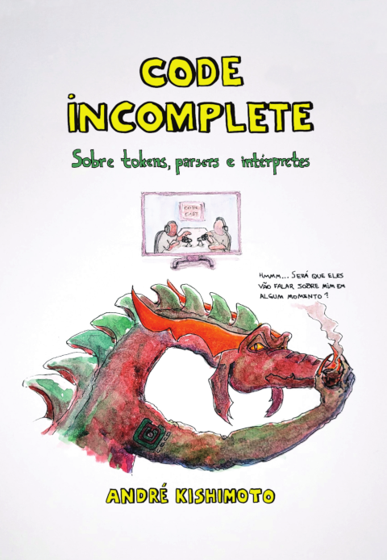

<a name="portugues"></a>
# PQC

[(For English, see below)](#english)

**PQC** ("Pequena Calculadora") é um interpretador implementado em linguagem C que realiza operações matemáticas simples.

O projeto foi inspirado no Tiny BASIC (descrito no *Dr. Dobb's Journal of Computer Calisthenics & Orthodontia - Volume One*) e em projetos acadêmicos que passo para as minhas turmas na disciplina de Estrutura de Dados (sou professor de Ciência da Computação).

## <a name="caracteristicas"></a>Características

- As expressões matemáticas são convertidas da notação infixa para a notação posfixa (RPN - *reverse polish notation*).
- Suporte a cinco operações binárias (adição, subtração, multiplicação, divisão e exponenciação) e ao operador unário de negação.
- Os operandos das expressões são variáveis de A à Z.
- Além das expressões matemáticas, há cinco comandos reconhecidos pelo interpretador:
    - `LET <var> = <value>` - Define o valor de uma variável, sendo `<var>` a variável (`A-Z`) e `<value>` o valor a ser atribuído à variável (`double`).
    - `VARS` - Exibe os valores das variáveis.
    - `RESET` - Reinicia os valores das variáveis.
    - `CLEAR` - Limpa a tela.
    - `EXIT` - Encerra o programa.


## Código-fonte

Este repositório contém apenas os arquivos `*.h` e `*.c`, além do `makefile`.

Há 7 versões do projeto (diretórios `v1`-`v7`). Cada versão incrementa a anterior com novas funcionalidades, refatoração e correção de bugs (leia o `README.md` de cada versão).

A versão final da **PQC** está no diretório `v7`.


## Compilação

O projeto foi desenvolvido com **MS Visual Studio 2022**, mas também foi compilado com **gcc 11.4.0** e **GNU Make 4.3** no Ubuntu 22.04.3 LTS (WLS).

Caso queira usar o Visual Studio, crie uma nova solução C++ e importe o código-fonte para o projeto.

Linux, MingW, MSYS2 et al., execute o `make` para compilar o projeto.


## Uso

Após compilar o projeto, rode o executável `pqc`.

A versão final (`v7`) suporta os comandos `LET`, `VARS`, `RESET`, `CLEAR` e `EXIT` (descritos na seção [Características](#caracteristicas)) e expressões matemáticas na notação infixa contendo apenas variáveis de `A` à `Z`.

Alguns exemplos de comandos válidos:

```
> LET A = 1.2
> LET B = 3.4
> LET X = 2
> A + B * X
> (A+B)^-X
> EXIT
```


## Material complementar (livro impresso)

Para complementar o código-fonte do projeto, publiquei um livro/zine impresso de 56 páginas, em português, descrevendo os passos que realizei durante o projeto, incluindo minhas decisões, pensamentos, problemas que encontrei durante o desenvolvimento e outros assuntos. 

Para mais informações sobre como adquirir o livro impresso, visite <a href="https://www.kishimoto.com.br/pqc" target="_blank">**https://www.kishimoto.com.br/pqc**</a> (envio apenas para o Brasil).




## Licença

Copyright &copy; 2024 André Kishimoto.

Projeto licenciado sob [Apache License 2.0](https://choosealicense.com/licenses/apache-2.0/).

---
---
<a name="english"></a>
# PQC

[(Para português, veja acima)](#portugues)

**PQC** (*"Pequena Calculadora"*, Portuguese for "Little Calculator") is an interpreter written in C that performs simple mathematical operations.

The project was inspired by Tiny BASIC (described in *Dr. Dobb's Journal of Computer Calisthenics & Orthodontia - Volume One*) and by academic projects that I assign to my students in a Data Structures course (I am a Computer Science professor).

## <a name="features"></a>Features

- Mathematical expressions are converted from infix notation to postfix notation (RPN - reverse polish notation).
- Support for five binary operations (addition, subtraction, multiplication, division, and exponentiation) and the unary negation operator.
- Expression operands are variables from A to Z.
- In addition to mathematical expressions, there are five commands recognized by the interpreter:
    - `LET <var> = <value>` - Sets the value of a variable, where `<var>` is the variable (`A-Z`) and `<value>` is the value to be assigned to the variable (`double`).
    - `VARS` - Displays the values of the variables.
    - `RESET` - Resets the values of the variables.
    - `CLEAR` - Clears the screen.
    - `EXIT` - Exits the program.


## Source code

This repository contains only the `*.h` and `*.c` files, as well as the `makefile`.

There are 7 versions of the project (directories `v1`-`v7`). Each version builds upon the previous one with new features, refactoring, and bug fixes (see the `README.md` file of each version).

The final version of **PQC** is in the `v7` directory.


## Compiling

The project was developed with **MS Visual Studio 2022**, but it has also been compiled with **gcc 11.4.0** and **GNU Make 4.3** on Ubuntu 22.04.3 LTS (WLS).

If you want to use Visual Studio, create a new C++ solution and import the source code into the project.

For Linux, MingW, MSYS2 et al., run `make` to compile the project.


## Usage

After compiling the project, run the `pqc` executable.

The final version (`v7`) supports the `LET`, `VARS`, `RESET`, `CLEAR`, and `EXIT` commands (described in the [Features](#features) section) and mathematical expressions in infix notation containing only variables from `A` to `Z`.

Some examples of valid commands:

```
> LET A = 1.2
> LET B = 3.4
> LET X = 2
> A + B * X
> (A+B)^-X
> EXIT
```


## Supplementary material (printed book)

To accompany the project's source code, I published a 56-page Brazilian-Portuguese printed book/zine describing the steps I took during the project, including my decisions, thoughts, problems I encountered during development, and other related topics.

For more information on how to obtain the printed book, visit <a href="https://www.kishimoto.com.br/pqc" target="_blank">**https://www.kishimoto.com.br/pqc**</a> (pt-BR site; at the moment I'm shipping only to Brazil).


## License

Copyright &copy; 2024 André Kishimoto.

Project licensed under the [Apache License 2.0](https://choosealicense.com/licenses/apache-2.0/).

